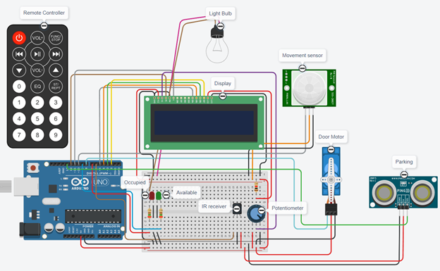
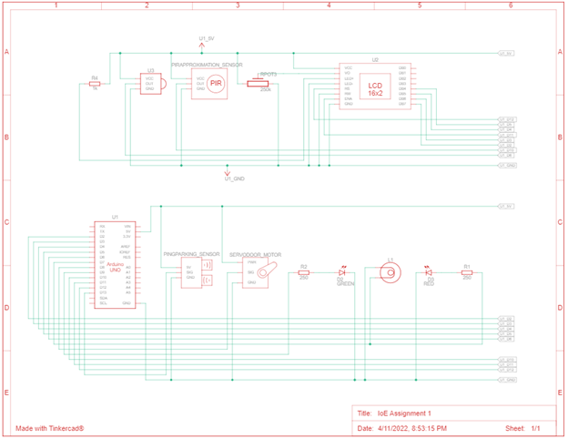

# Arduino-Parking-System
Parking garage system - A arduino project source code for a garage system that will detect presence of a car, opens the doors and turns the lights on.
## Design

## Components List
* 1x Arduino Uno R3
* 1x  Breadboard
* 2x LED
* 1x Potentiometer
* 1x LCD 16x2
* 3x Resistor
* 1x IR Remote
* 1x IR Receiver
* 1x Light bulb
* 1x Servo Motor

## Schematic View

